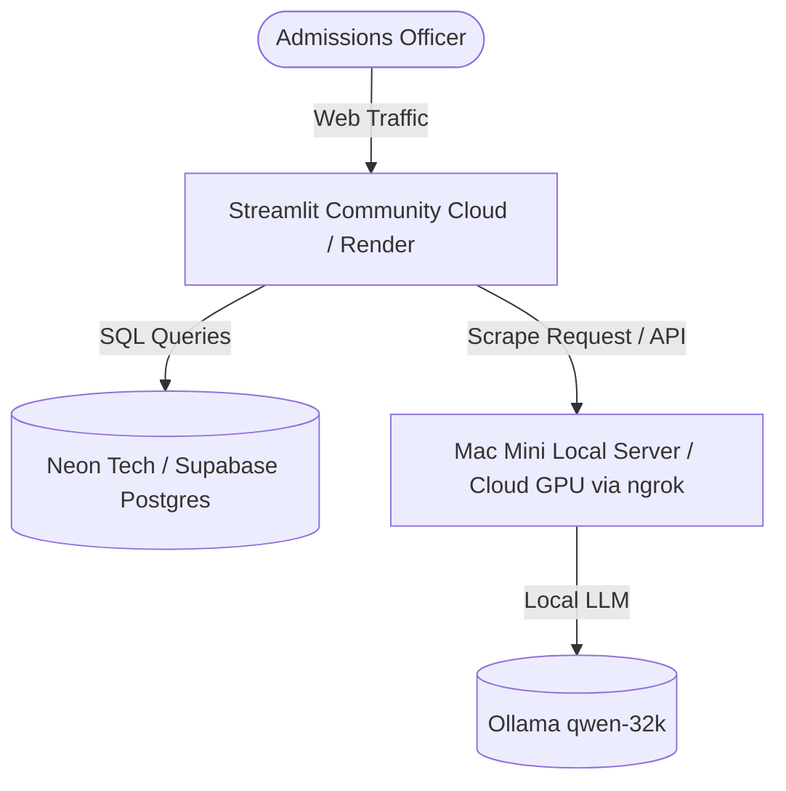

# 🚀 TurtleVest Onboarding & Multi-User Deployment Strategy

This document outlines the architecture, resource planning, and user experience (UX) onboarding strategy for deploying TurtleVest for the **College Admissions Process**.

---

## 🏛️ 1. Multi-User Architecture & Resource Constraints

In a multi-user environment, Streamlit handles sessions cleanly, but your server's backend resources face specific constraints:

| Component | Multi-User Behavior | Constraints & Solutions |
| :--- | :--- | :--- |
| **Frontend UI (Streamlit)** | Sandboxed per user session. | Lightweight. Can be hosted on free/cheap tiers (e.g., Streamlit Community Cloud, Render, Hugging Face). |
| **Database (PostgreSQL)** | Handles concurrent read/writes. | Safe and efficient. DB connection pooling handles multiple users easily. |
| **SEC Scraper & LLM API** | Heavy CPU/VRAM load. | **Critical Bottleneck**: Concurrently parsing 10K/Q documents via Ollama (`qwen-32k` / `gemma4`) will queue requests or overload GPU memory. |

---

## 🎓 2. The Admissions Officer Onboarding Rule

> [!IMPORTANT]
> **DO NOT require a user registration or login wall.**
> Admissions readers spend **4 to 7 minutes** reviewing your entire application file. A login wall requiring sign-ups, email verification, or passwords will result in them closing the tab. The site must load instantly.

### Recommended Security: Passcode Bypass (Instead of Login)
To prevent web scrapers and crawlers from spamming your server while keeping the entrance seamless for admissions officers:
1. Include a single text input field at the top: **"Enter Access Code to Unlock Live Search"**.
2. Share the code in your application materials (e.g., `Penn2026`).
3. Entering the code activates the search input, avoiding signup forms entirely.

---

## ⚡ 3. The "Premium Basket" Pre-Caching Strategy

To protect your server's hardware from melting under high traffic, pre-cache a basket of high-profile companies.

### Step 1: Pre-Run Core Tickers
Before submitting your application link, run the scraping and indexing pipeline for 10–15 major tickers:
*   `NVDA` (Nvidia)
*   `AAPL` (Apple)
*   `MSFT` (Microsoft)
*   `COHR` (Coherent - good test of NLP report fallback)
*   `QCOM` (Qualcomm)
*   `AMAT` (Applied Materials)
*   `TSLA` (Tesla)
*   `WMT` (Walmart)

### Step 2: Immediate Load UI
When the admissions officer opens these pre-cached tickers, the app loads the data directly from your PostgreSQL cache. The response is **instant (under 500ms)** and places **zero load** on your LLM server.

---

## 🛠️ 4. How to Implement the "Quick Demo Tickers" UI

Add a helper row below the search input in `app.py` to encourage users to click cached data.

### Implementation Blueprint:
```python
# Session state initialization for ticker
if "ticker" not in st.session_state:
    st.session_state.ticker = st.query_params.get("ticker", "NVDA").upper().strip()

ticker = st.text_input("Enter Ticker Symbol (e.g., NVDA, AAPL, TSLA)", key="ticker").upper().strip()
st.query_params["ticker"] = ticker

# Clickable Pre-cached Buttons
st.markdown("💡 **Quick Demo (Instant Load):** Click to view pre-cached datasets:")
col_demo1, col_demo2, col_demo3, col_demo4, col_demo5 = st.columns(5)
with col_demo1:
    if st.button("🚀 NVDA"):
        st.session_state.ticker = "NVDA"
        st.rerun()
with col_demo2:
    if st.button("🍎 AAPL"):
        st.session_state.ticker = "AAPL"
        st.rerun()
with col_demo3:
    if st.button("📡 QCOM"):
        st.session_state.ticker = "QCOM"
        st.rerun()
with col_demo4:
    if st.button("🔬 COHR"):
        st.session_state.ticker = "COHR"
        st.rerun()
with col_demo5:
    if st.button("⚡ TSLA"):
        st.session_state.ticker = "TSLA"
        st.rerun()
```

---

## 🌐 5. Recommended Cloud Deployment Setup

To host the application stably:



*   **Frontend**: Streamlit Community Cloud (Free, fast, automatic SSL certificates).
*   **Database**: Neon.tech or Supabase (Free tier PostgreSQL with connection pooling and fast remote latency).
*   **Backend Parser**: Keep running on your local Mac Mini, using `ngrok` or `localtunnel` to map port `3000` to a secure public endpoint (e.g., `https://your-api.ngrok-free.app`), and configure your python `app.py` requests to point there.
